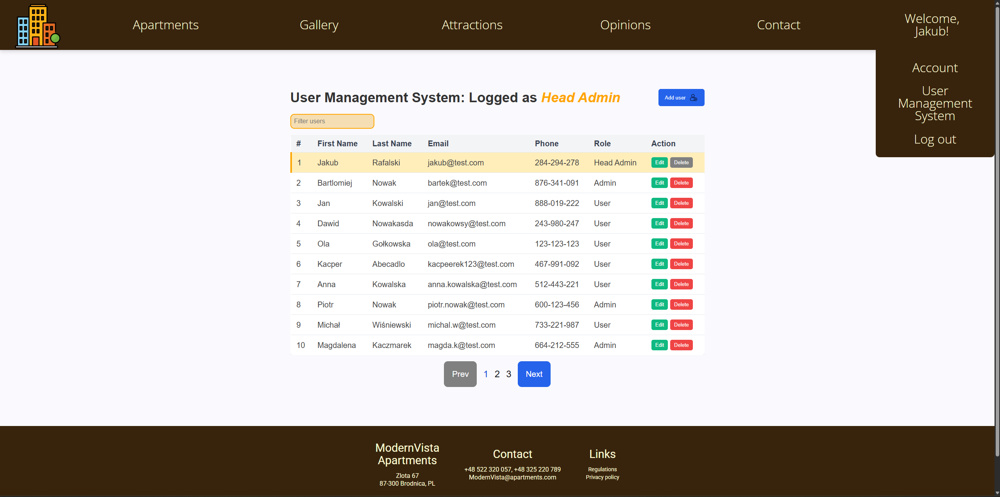
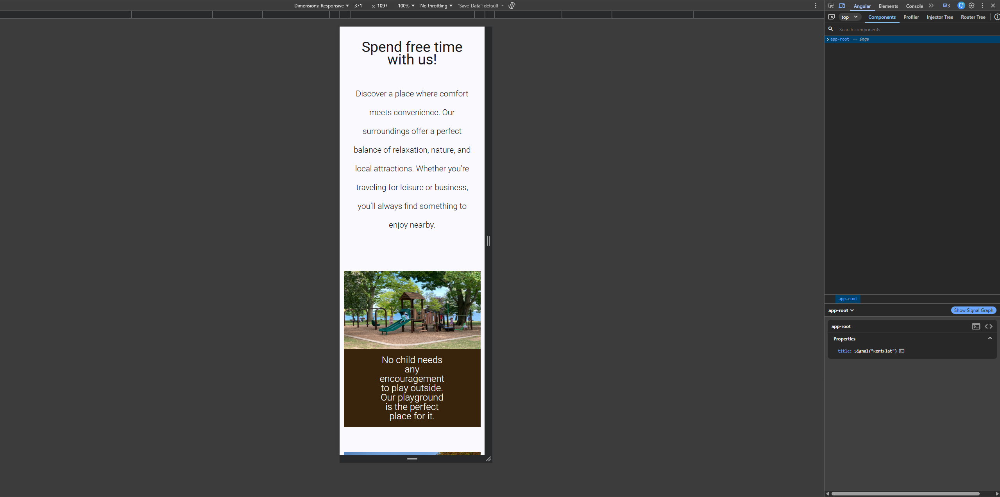

# 🏨 Apartment Management App

## 📌 Project Description

This is a frontend web application built with Angular that allows users to browse apartments, view details, and manage user data through an admin panel.
The application includes authentication, role-based access, and a responsive user interface.

## 🚀 Features
- User authentication (login / logout)
- Role-based access control
- User management (CRUD operations)
- Filtering, sorting, and pagination of users
- Responsive layout (desktop & mobile)
- Image slider for apartment previews
- Error handling and loading states

## 🛠 Technologies
- Angular (Signals, routing, guards)
- TypeScript
- CSS (Flexbox, responsive design)
- JSON Server (mock REST API)

## ▶️ Getting Started

1. Install dependencies
```bash
npm install
```
2. Run Angular app
```bash
npm start
```
3. Run mock API (JSON Server)
```bash
npx json-server --watch db.json -p 5000
```

## 📸 Screenshots

### Dashboard


### User Management


### Mobile View


### Image Slider


## 🔮 Future Improvements
- Backend integration (real API)
- JWT authentication
- Improved form validation
- Better UI/UX polish